# Estimation Project #

## The Goal of this Project ##

In this project, we will be developing an estimator to be used by your controller to successfully fly a desired flight path using realistic sensors. 

<p align="center">
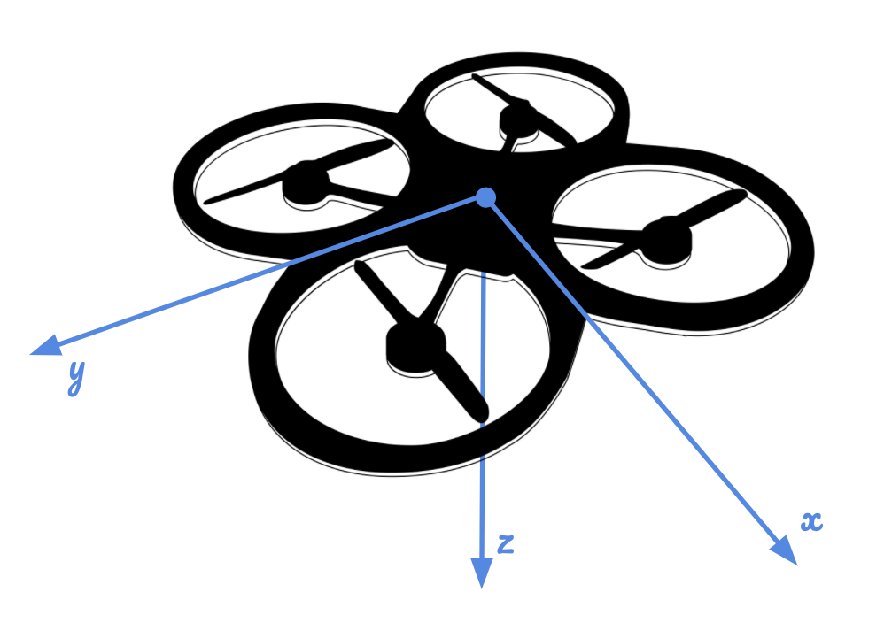
</p>

## Writeup ##
- [README](./README.md) 

## Implement Estimator ##
- [QuadEstimatorEKF.cpp](src/QuadEstimatorEKF.cpp) and [QuadEstimatorEKF.txt](config/QuadEstimatorEKF.txt) containing your estimator and associated estimator parameters that successfully meets all the performance criteria.
- [QuadController.cpp](src/QuadControl.cpp) and [QuadControlParams.txt](config/QuadControlParams.txt) containing your re-tuned controller needed to work successfully with your estimator.
---


### Step 1: Sensor Noise ###
#### Determine the standard deviation of the measurement noise of both GPS X data and Accelerometer X data. ####
The calculated standard deviation should correctly capture ~68% of the sensor measurements. Your writeup should describe the method used for determining the standard deviation given the simulated sensor measurements. 

- changes are reflected in [config/06_SensorNoise.txt](config/06_SensorNoise.txt)
- MeasuredStdDev_GPSPosXY = 0.67
- MeasuredStdDev_AccelXY = .49
- Config logs [config/log/Graph1.txt](test/GraphSN1.txt) and [config/log/Graph1.txt](test/GraphSN2.txt)
- [Standard deviation processor](test/SensorNoise.py)

```
- Run simulator using 06_NoisySensors.txt
- Collect Config logs
- Process standard deviation using collected files 
- Updated config/6_Sensornoise.txt with computed MeasuredStdDev_GPSPosXY and MeasuredStdDev_AccelXY
- Run the simulator using update 06_NoisySensors.txt, sensor mesurements should correctly capture ~68%
```
 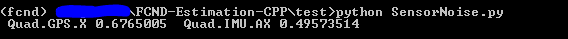 

 Before                     |  After
 :-------------------------:|:-------------------------:
 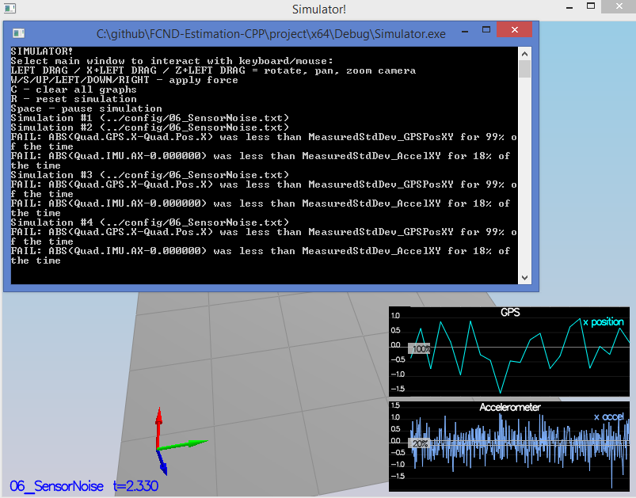 |  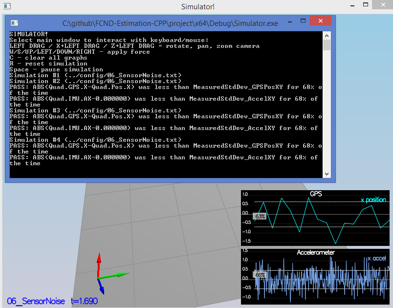
 
 ----
### Step 2: Attitude Estimation ###
#### Implement a better rate gyro attitude integration scheme in the UpdateFromIMU() function. ####
The improved integration scheme should result in an attitude estimator of < 0.1 rad for each of the Euler angles for a duration of at least 3 seconds during the simulation. The integration scheme should use quaternions to improve performance over the current simple integration scheme. 

- changes are reflected in [src/QuadEstimatorEKF.cpp#L96-L108](src/QuadEstimatorEKF.cpp#L96-L108)

```
- Comment out predictedPitch ,predictedRoll and ekfState(6) to avoid integrating yaw twice
- Use quaternions as integration scheme to improve performance over current simple integration scheme
- Though not Euler angles, Quaternion has IntegrateBodyRate to use.
- Compute predictedPitch, predictedRoll and ekfState(6) using Quaternion Roll, Pitch and Yaw
```
<p align="center">
 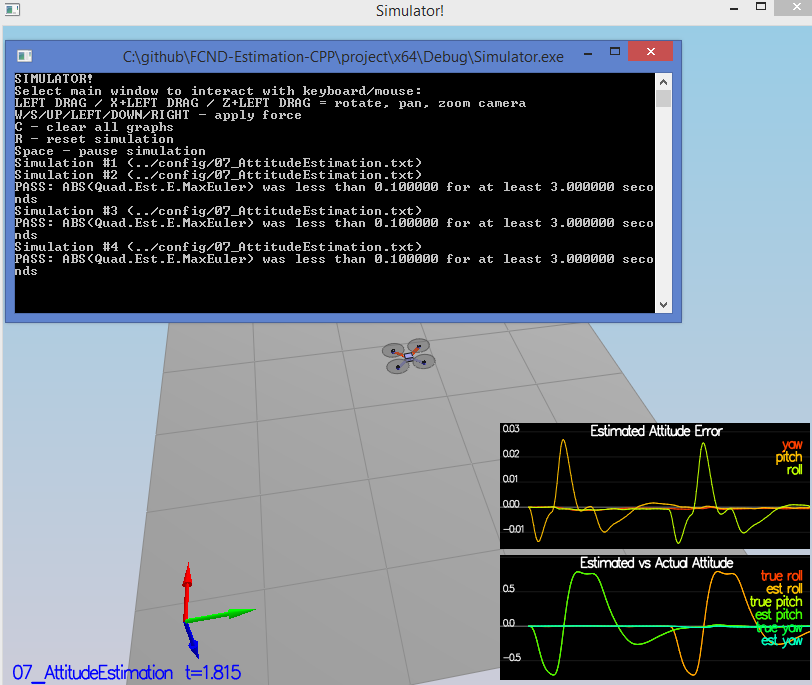 
</p>

 ----
### Step 3: Prediction Step ###
#### Implement all of the elements of the prediction step for the estimator. ####
The prediction step should include the state update element (PredictState() function), a correct calculation of the Rgb prime matrix, and a proper update of the state covariance. The acceleration should be accounted for as a command in the calculation of gPrime. The covariance update should follow the classic EKF update equation. 

- changes are reflected for PredictState in [PredictState()#L173-L192](src/QuadEstimatorEKF.cpp#L173-L192)
- changes are reflected for GetRbgPrime in [GetRbgPrime()#L216-L234](src/QuadEstimatorEKF.cpp#L216-L234)
- changes are reflected for Predict in [Predict()#L277-L291](src/QuadEstimatorEKF.cpp#L277-L291)
- changes are reflected for Covariance in [QuadEstimatorEKF.cpp#L289](src/QuadEstimatorEKF.cpp#L289)
- [Predict ref](images/function_predict.gif)
- [RBGPrime ref](images/rbg_prime.gif)
- [Jacobian ref](images/jacobian.gif)
- [Transition ref](images/transition_function.gif)
- [Covariance ref](images/update_state_covariance.gif)

```
Predict consist of the following
- PredictState(7 states):
  -- predict x, y, z (3 states)
  -- attitude.Rotate_BtoI(<V3F>) to rotate a vector from body frame to inertial frame
  -- predict x_dot, y_dot, z_dot (3 states)
  -- yaw get updated in IMU code (1 state)
- GetRbgPrime(as indicated by RBGPrime):
  -- This is just a matter of putting the right sin() and cos() functions in the right place.
- Compute GPrime using Transition and Jacobian reference
- Finally compute state covariance
```
PredictState                     |  PredictCovariance
 :-------------------------:|:-------------------------:
 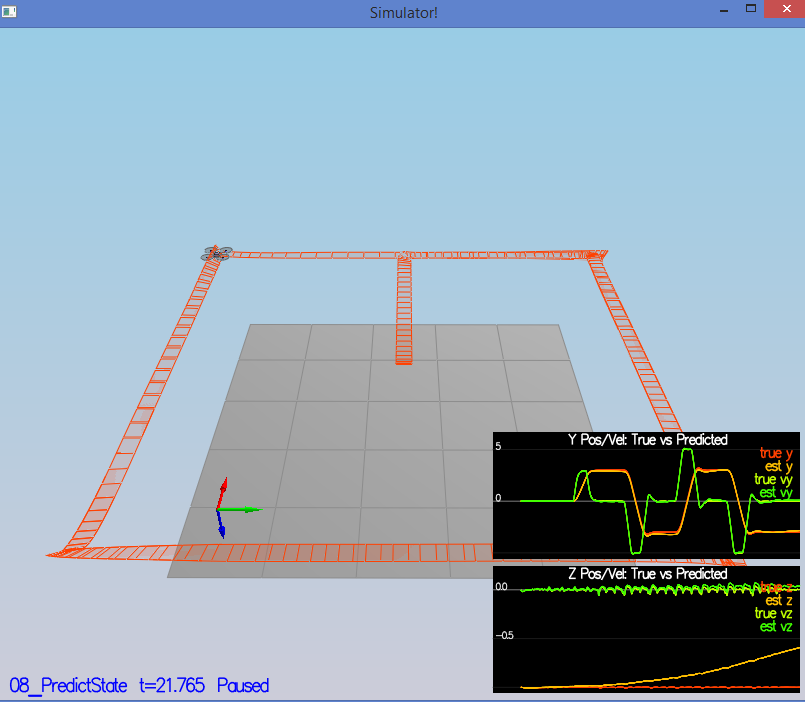 |  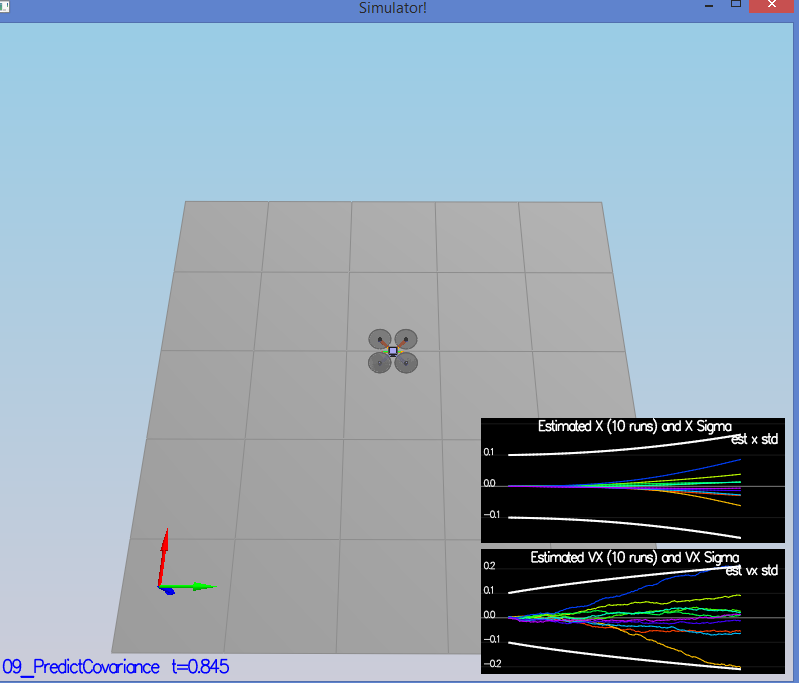
 
 ----
### Step 4: Magnetometer Update ###
#### Implement the magnetometer update. ####
The update should properly include the magnetometer data into the state. Note that the solution should make sure to correctly measure the angle error between the current state and the magnetometer value (error should be the short way around, not the long way). 

- changes are reflected in [src/QuadEstimatorEKF.cpp#L342-L361](src/QuadEstimatorEKF.cpp#L342-L361)

```
- Get yaw estimates
- Normalize the difference between your measured and estimated yaw to -pi .. pi
- Update Partial Derivative of Mesurement model hPrime
```
<p align="center">
 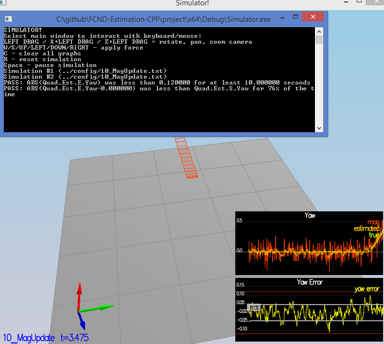 
</p>

 ----
### Step 5: Closed Loop + GPS Update ###
#### Implement the GPS update. ####
The estimator should correctly incorporate the GPS information to update the current state estimate. 

- changes are reflected in [src/QuadEstimatorEKF.cpp#L313-L323](src/QuadEstimatorEKF.cpp#L313-L323)
- changes are reflected in [config/11_GPSUpdate.txt](config/11_GPSUpdate.txt)
- Quad.UseIdealEstimator = 0
- #SimIMU.AccelStd = 0,0,0
- #SimIMU.GyroStd = 0,0,0
- "Estimation for Quadrotors" paper equations (53), (54), and (55)  
<p align="center">
 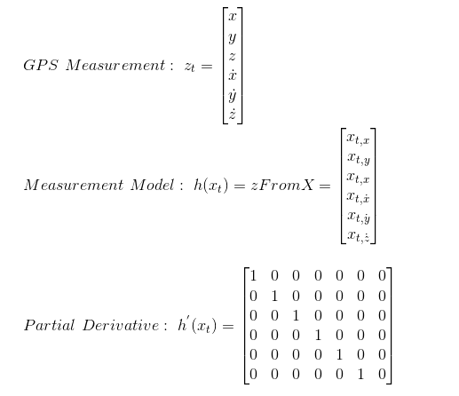 
</p>

```
- Get yaw estimates
- Update Partial Derivative hPrime which is identity matrix here
```
<p align="center">
 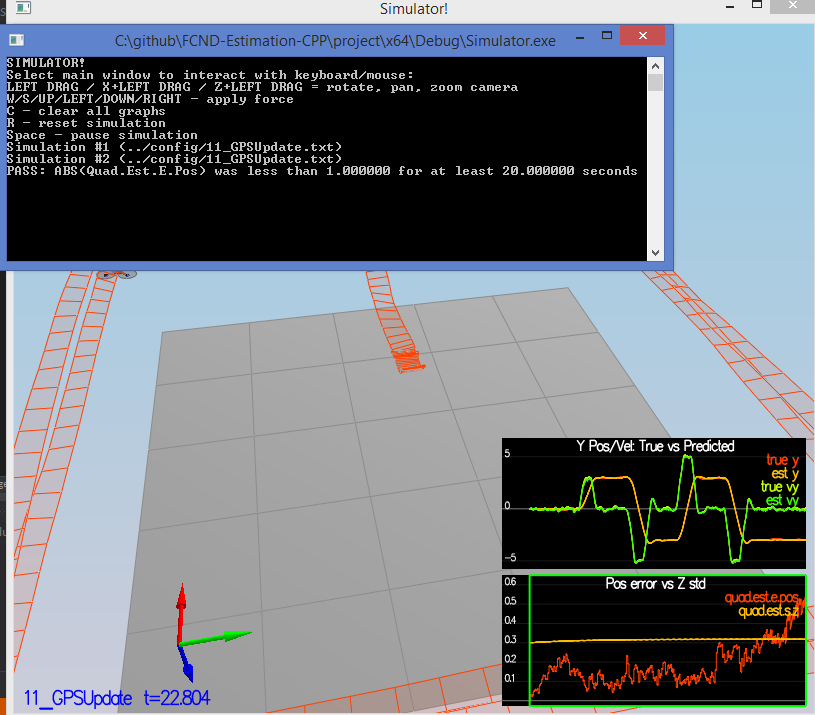 
</p>


 ----
## Flight Evaluation ##

### Meet the performance criteria of each step. ###
For each step of the project, the final estimator should be able to successfully meet the performance criteria with the controller provided. The estimator's parameters should be properly adjusted to satisfy each of the performance criteria elements. 
```
- All scenarios meet the performance criteria, as shown in the previous sections.
```

### Task 6: Adding Own Controller ###

#### De-tune your controller to successfully fly the final desired box trajectory with your estimator and realistic sensors. ####
The controller developed in the previous project should be de-tuned to successfully meet the performance criteria of the final scenario (<1m error for entire box flight). 

```
- QuadController.cpp is updated from last project
- QuadControlParams.txt is updated from last project
- The controller added from previous project successfully meet the performance criteria of the final scenario (<1m error for entire box flight).
- Position and velocity gains have gone down from the initial value. This is enough to make the drone fly with an error of <1m for the entire box flight as shown in Task 5.
```
- Updated to control Yaw in [src/QuadControl.cpp#L273-L287](src/QuadControl.cpp#L273-L287)
- Updated to control Laterial position in [src/QuadControl.cpp#L234-L254](src/QuadControl.cpp#L234-L254)
- Updated position controls in [config/QuadControlParams.txt#L21-L24](config/QuadControlParams.txt#L21-L24)
- Updated velocity controls in [config/QuadControlParams.txt#L26-L28](config/QuadControlParams.txt#L26-L28)
- Updated angle controls in [config/QuadControlParams.txt#L30-L32](config/QuadControlParams.txt#L30-L32)
- Updated angle rate in [config/QuadControlParams.txt#L34-L35](config/QuadControlParams.txt#L34-L35)

###### Before Detuning of Controller ######
<p align="center">
 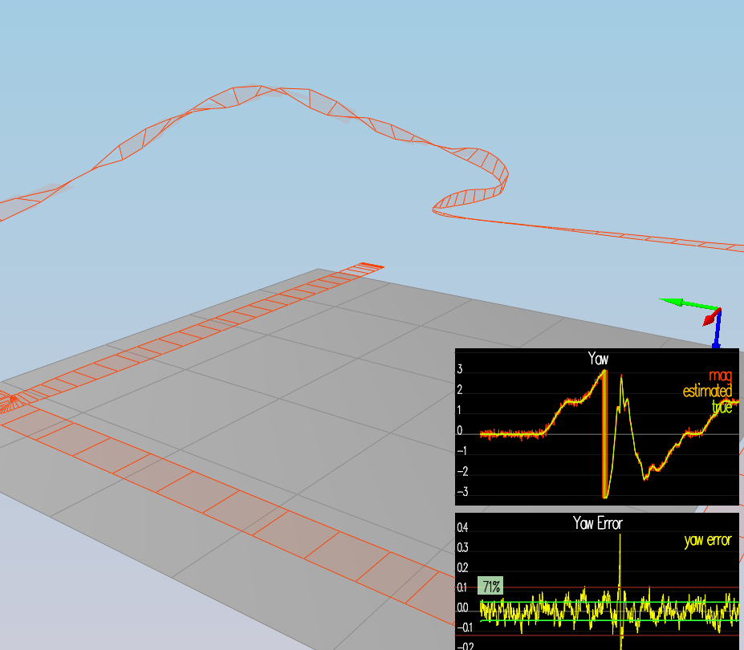 
</p>

###### Magnetometer After Detuning of Controller ######
<p align="center">
 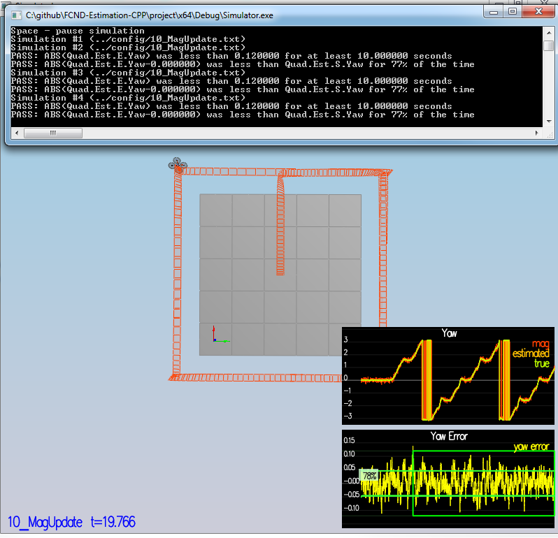 
</p>

###### GPS After Detuning of Controller ######
<p align="center">
 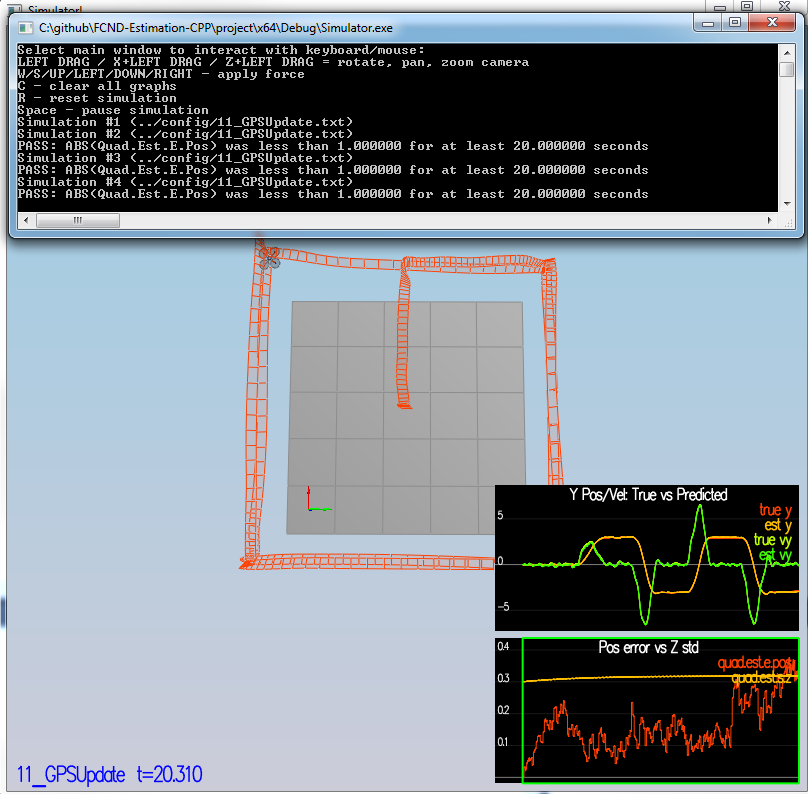 
</p>


MonteCarloTest                     |  TestManyQuads
 :-------------------------:|:-------------------------:
 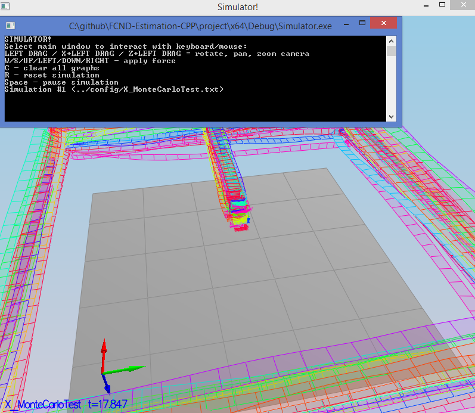 |  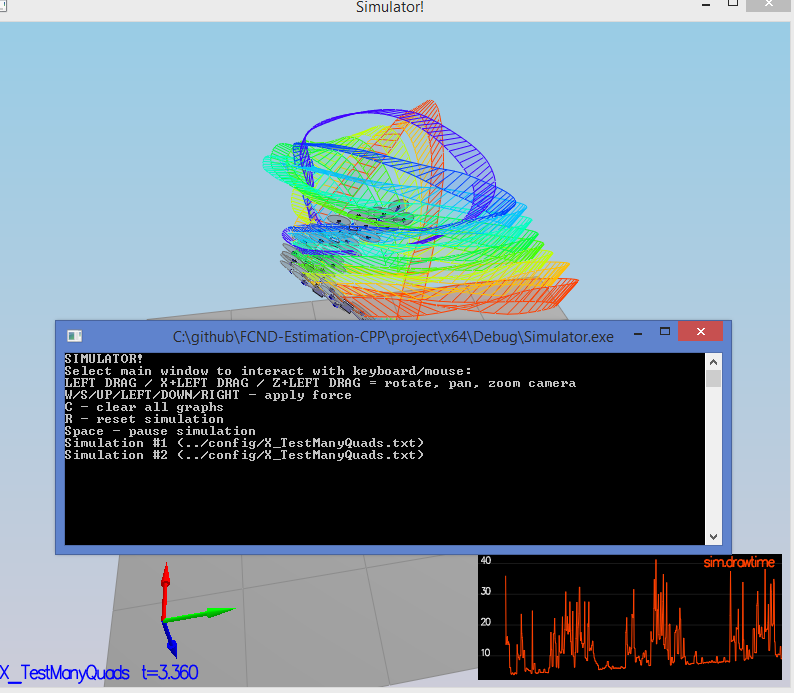

 ----
Note: More information from [Udacity Readme.md](README-Udacity.md)

 ----
